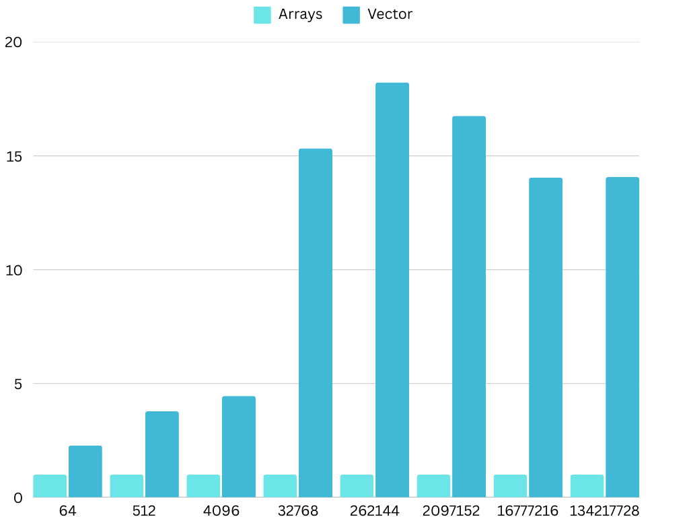
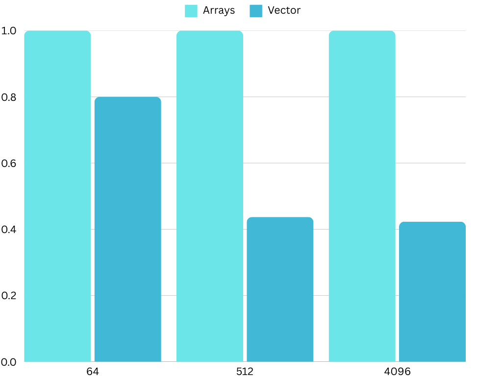

In this post we’re going to discuss our results from testing Java’s
Vector API on PPC64LE.

# Test Harness:

JavaVectorAPI-1: <https://github.com/tomerr90/JavaVectorAPI-1.git>

# Test Design:

Starting with JDK 17 we will run all five test suites from
JavaVectorAPI-1.

Then we’ll run JDK 21 on the ArrayStat test suite.

# Test Results:

## SimpleSum

    Benchmark          (arraySize)  Mode  Cnt         Score        Error  Units
    SimpleSum.arrays            64  avgt   25        34.784 ±      0.007  ns/op
    SimpleSum.arrays           512  avgt   25       158.986 ±      0.025  ns/op
    SimpleSum.arrays          4096  avgt   25      1166.003 ±      0.145  ns/op
    SimpleSum.arrays         32768  avgt   25      9224.854 ±     83.709  ns/op
    SimpleSum.arrays        262144  avgt   25     84904.101 ±   1883.264  ns/op
    SimpleSum.arrays       2097152  avgt   25    705007.184 ±   4337.230  ns/op
    SimpleSum.arrays      16777216  avgt   25   9049292.697 ±   4541.650  ns/op
    SimpleSum.arrays     134217728  avgt   25  69483641.235 ± 218003.080  ns/op
    SimpleSum.vectors           64  avgt   25        27.657 ±      0.006  ns/op
    SimpleSum.vectors          512  avgt   25       144.079 ±      0.023  ns/op
    SimpleSum.vectors         4096  avgt   25      1035.757 ±      0.116  ns/op
    SimpleSum.vectors        32768  avgt   25      8235.989 ±    146.688  ns/op
    SimpleSum.vectors       262144  avgt   25     80131.092 ±   1812.120  ns/op
    SimpleSum.vectors      2097152  avgt   25    696995.965 ±  10967.094  ns/op
    SimpleSum.vectors     16777216  avgt   25   8948626.473 ±  17838.771  ns/op
    SimpleSum.vectors    134217728  avgt   25  68802749.490 ± 212584.976  ns/op

<figure>

</figure>

## SimpleSumNoSuperWord

    Benchmark                     (arraySize)  Mode  Cnt          Score        Error  Units
    SimpleSumNoSuperWord.arrays            64  avgt   25         60.631 ±      0.017  ns/op
    SimpleSumNoSuperWord.arrays           512  avgt   25        390.636 ±      0.063  ns/op
    SimpleSumNoSuperWord.arrays          4096  avgt   25       3000.841 ±      0.256  ns/op
    SimpleSumNoSuperWord.arrays         32768  avgt   25      23913.976 ±      7.919  ns/op
    SimpleSumNoSuperWord.arrays        262144  avgt   25     227423.743 ±    129.359  ns/op
    SimpleSumNoSuperWord.arrays       2097152  avgt   25    1532705.888 ±    910.341  ns/op
    SimpleSumNoSuperWord.arrays      16777216  avgt   25   12567922.151 ±  11467.932  ns/op
    SimpleSumNoSuperWord.arrays     134217728  avgt   25  100049666.836 ± 160459.768  ns/op
    SimpleSumNoSuperWord.vectors           64  avgt   25         32.864 ±      0.017  ns/op
    SimpleSumNoSuperWord.vectors          512  avgt   25        148.442 ±      0.094  ns/op
    SimpleSumNoSuperWord.vectors         4096  avgt   25       1039.094 ±      0.086  ns/op
    SimpleSumNoSuperWord.vectors        32768  avgt   25       8293.992 ±    163.019  ns/op
    SimpleSumNoSuperWord.vectors       262144  avgt   25      81072.922 ±    959.954  ns/op
    SimpleSumNoSuperWord.vectors      2097152  avgt   25     706270.498 ±   8207.936  ns/op
    SimpleSumNoSuperWord.vectors     16777216  avgt   25    8941515.137 ±  21745.836  ns/op
    SimpleSumNoSuperWord.vectors    134217728  avgt   25   68663039.980 ± 186121.838  ns/op

<figure>

</figure>

## ComplexExpression

    Benchmark                  (arraySize)  Mode  Cnt          Score       Error  Units
    ComplexExpression.arrays            64  avgt   25        104.989 ±     0.012  ns/op
    ComplexExpression.arrays           512  avgt   25        709.091 ±     0.047  ns/op
    ComplexExpression.arrays          4096  avgt   25       5548.953 ±     2.131  ns/op
    ComplexExpression.arrays         32768  avgt   25      44257.633 ±     2.383  ns/op
    ComplexExpression.arrays        262144  avgt   25     370868.600 ±  1278.226  ns/op
    ComplexExpression.arrays       2097152  avgt   25    2846673.315 ±   637.223  ns/op
    ComplexExpression.arrays      16777216  avgt   25   22778832.441 ±   910.898  ns/op
    ComplexExpression.arrays     134217728  avgt   25  182261311.036 ± 22354.886  ns/op
    ComplexExpression.vectors           64  avgt   25         94.106 ±     0.005  ns/op
    ComplexExpression.vectors          512  avgt   25        700.638 ±     0.035  ns/op
    ComplexExpression.vectors         4096  avgt   25       5537.653 ±     0.824  ns/op
    ComplexExpression.vectors        32768  avgt   25      44233.357 ±     2.070  ns/op
    ComplexExpression.vectors       262144  avgt   25     371897.925 ±  2100.587  ns/op
    ComplexExpression.vectors      2097152  avgt   25    2845657.941 ±   543.106  ns/op
    ComplexExpression.vectors     16777216  avgt   25   22789411.756 ±  1479.213  ns/op
    ComplexExpression.vectors    134217728  avgt   25  182282093.428 ± 22571.844  ns/op

<figure>

</figure>

## ComplexExpressionNoSuperWord

    Benchmark                             (arraySize)  Mode  Cnt          Score       Error  Units
    ComplexExpressionNoSuperWord.arrays            64  avgt   25        204.415 ±     0.009  ns/op
    ComplexExpressionNoSuperWord.arrays           512  avgt   25       1564.593 ±     0.093  ns/op
    ComplexExpressionNoSuperWord.arrays          4096  avgt   25      12413.537 ±     1.770  ns/op
    ComplexExpressionNoSuperWord.arrays         32768  avgt   25      99132.151 ±     6.331  ns/op
    ComplexExpressionNoSuperWord.arrays        262144  avgt   25     827805.352 ±    49.440  ns/op
    ComplexExpressionNoSuperWord.arrays       2097152  avgt   25    6348770.039 ±   466.195  ns/op
    ComplexExpressionNoSuperWord.arrays      16777216  avgt   25   50770345.853 ±  3772.581  ns/op
    ComplexExpressionNoSuperWord.arrays     134217728  avgt   25  406104270.050 ± 31769.452  ns/op
    ComplexExpressionNoSuperWord.vectors           64  avgt   25         94.131 ±     0.005  ns/op
    ComplexExpressionNoSuperWord.vectors          512  avgt   25        700.841 ±     0.050  ns/op
    ComplexExpressionNoSuperWord.vectors         4096  avgt   25       5537.868 ±     0.276  ns/op
    ComplexExpressionNoSuperWord.vectors        32768  avgt   25      44607.321 ±   344.487  ns/op
    ComplexExpressionNoSuperWord.vectors       262144  avgt   25     373980.780 ±  1624.161  ns/op
    ComplexExpressionNoSuperWord.vectors      2097152  avgt   25    2845735.861 ±   296.528  ns/op
    ComplexExpressionNoSuperWord.vectors     16777216  avgt   25   22786963.260 ±  2302.327  ns/op
    ComplexExpressionNoSuperWord.vectors    134217728  avgt   25  182256404.289 ± 21236.016  ns/op

<figure>

</figure>

## ArrayStats

    Benchmark           (arraySize)  Mode  Cnt           Score          Error  Units
    ArrayStats.arrays            64  avgt   25         173.204 ±        1.946  ns/op
    ArrayStats.arrays           512  avgt   25        2993.673 ±       66.769  ns/op
    ArrayStats.arrays          4096  avgt   25       23101.879 ±      120.112  ns/op
    ArrayStats.arrays         32768  avgt   25      197373.938 ±      304.354  ns/op
    ArrayStats.arrays        262144  avgt   25     1560319.817 ±    31503.355  ns/op
    ArrayStats.arrays       2097152  avgt   25    12840152.179 ±     5294.177  ns/op
    ArrayStats.arrays      16777216  avgt   25   102818110.509 ±   138546.117  ns/op
    ArrayStats.arrays     134217728  avgt   25   824284962.049 ±   552423.730  ns/op
    ArrayStats.vectors           64  avgt   25        2030.180 ±       12.185  ns/op
    ArrayStats.vectors          512  avgt   25       16984.482 ±       94.298  ns/op
    ArrayStats.vectors         4096  avgt   25      136836.929 ±      832.629  ns/op
    ArrayStats.vectors        32768  avgt   25     1090922.884 ±     6335.406  ns/op
    ArrayStats.vectors       262144  avgt   25     8723547.613 ±    59668.835  ns/op
    ArrayStats.vectors      2097152  avgt   25    69712280.978 ±   358104.987  ns/op
    ArrayStats.vectors     16777216  avgt   25   557562874.749 ±  3136531.662  ns/op
    ArrayStats.vectors    134217728  avgt   25  4487263831.693 ± 32044099.047  ns/op

<figure>

</figure>

## ArrayStats Java 21

    Benchmark           (arraySize)  Mode  Cnt           Score          Error  Units
    ArrayStats.arrays            64  avgt   25         175.309 ±        1.252  ns/op
    ArrayStats.arrays           512  avgt   25        1367.999 ±       23.131  ns/op
    ArrayStats.arrays          4096  avgt   25       20784.980 ±      141.985  ns/op
    ArrayStats.arrays         32768  avgt   25      184748.363 ±      364.153  ns/op
    ArrayStats.arrays        262144  avgt   25     1483872.771 ±      726.253  ns/op
    ArrayStats.arrays       2097152  avgt   25    11663031.064 ±   405786.141  ns/op
    ArrayStats.arrays      16777216  avgt   25    98332623.853 ±  2581086.990  ns/op
    ArrayStats.arrays     134217728  avgt   25   815526271.277 ±  6892427.913  ns/op
    ArrayStats.vectors           64  avgt   25        2025.960 ±       13.721  ns/op
    ArrayStats.vectors          512  avgt   25       17047.354 ±       96.891  ns/op
    ArrayStats.vectors         4096  avgt   25      136894.945 ±      871.571  ns/op
    ArrayStats.vectors        32768  avgt   25     1097506.746 ±     6892.098  ns/op
    ArrayStats.vectors       262144  avgt   25     8699864.863 ±    43085.837  ns/op
    ArrayStats.vectors      2097152  avgt   25    69905494.516 ±   398534.054  ns/op
    ArrayStats.vectors     16777216  avgt   25   557455911.534 ±  3346827.839  ns/op
    ArrayStats.vectors    134217728  avgt   25  4440794269.520 ± 18770580.856  ns/op

<figure>

</figure>

## ArrayStat Java 17 on Xeon E-2378

    Benchmark           (arraySize)  Mode  Cnt          Score         Error  Units
    ArrayStats.arrays            64  avgt   25        107.331 ±       1.809  ns/op
    ArrayStats.arrays           512  avgt   25        627.478 ±       4.180  ns/op
    ArrayStats.arrays          4096  avgt   25       4694.807 ±      14.099  ns/op
    ArrayStats.arrays         32768  avgt   25     168781.982 ±    2024.674  ns/op
    ArrayStats.arrays        262144  avgt   25    1673768.937 ±   24404.886  ns/op
    ArrayStats.arrays       2097152  avgt   25   13563443.991 ±  198680.783  ns/op
    ArrayStats.arrays      16777216  avgt   25  111342926.431 ± 2769759.098  ns/op
    ArrayStats.arrays     134217728  avgt   25  908709016.578 ± 3801799.608  ns/op
    ArrayStats.vectors           64  avgt   25         48.167 ±       0.004  ns/op
    ArrayStats.vectors          512  avgt   25        165.846 ±       0.542  ns/op
    ArrayStats.vectors         4096  avgt   25       1053.841 ±       5.038  ns/op
    ArrayStats.vectors        32768  avgt   25      11007.992 ±       3.730  ns/op
    ArrayStats.vectors       262144  avgt   25      91793.273 ±     333.415  ns/op
    ArrayStats.vectors      2097152  avgt   25     809176.104 ±    3229.474  ns/op
    ArrayStats.vectors     16777216  avgt   25    7921394.224 ±   27940.795  ns/op
    ArrayStats.vectors    134217728  avgt   25   64577194.475 ±  349795.706  ns/op

<figure>

</figure>

## Disabling AutoSIMD (-Xjit:disableAutoSIMD)

SimpleSum

    Benchmark          (arraySize)  Mode  Cnt     Score   Error  Units
    SimpleSum.arrays            64  avgt   25    40.804 ± 0.018  ns/op
    SimpleSum.arrays           512  avgt   25   313.212 ± 0.705  ns/op
    SimpleSum.arrays          4096  avgt   25  2456.077 ± 9.081  ns/op
    SimpleSum.vectors           64  avgt   25    50.795 ± 0.280  ns/op
    SimpleSum.vectors          512  avgt   25   716.558 ± 1.550  ns/op
    SimpleSum.vectors         4096  avgt   25  5745.166 ± 2.368  ns/op

<figure>

</figure>

# Analysis:

The results from our Java 17 show performance improvements for pure
vectorized work loads, however these gains are not as dramatic as those
seen in the original x64 based lab:

<https://medium.com/@tomerr90/javas-new-vector-api-how-fast-is-it-part-1-1b4c2b573610>

In the case of PPC64LE, the "branch-less" ArrayStats tests show a
degradation of performance compared to a non-vector implementation. The
loss of performance is deep enough that Java developers on PPC64LE
should take note; vectorizing if-statements on this platform does not
appear to provide a performance boost as seen in other workloads.

## Why?

Lets go back to <https://openjdk.org/jeps/438> and
<https://openjdk.org/jeps/448> to re-read its goals & non-goals:

> Platform agnostic — The API should be CPU architecture agnostic,
> enabling implementations on multiple architectures supporting vector
> instructions. As is usual in Java APIs, where platform optimization
> and portability conflict then we will bias toward making the API
> portable, even if that results in some platform-specific idioms not
> being expressible in portable code.
>
> —  JEP-438 and JEP-448

> Reliable runtime compilation and performance on x64 and AArch64
> architectures — On capable x64 architectures the Java runtime,
> specifically the HotSpot C2 compiler, should compile vector operations
> to corresponding efficient and performant vector instructions, such as
> those supported by Streaming SIMD Extensions (SSE) and Advanced Vector
> Extensions (AVX). Developers should have confidence that the vector
> operations they express will reliably map closely to relevant vector
> instructions. On capable ARM AArch64 architectures C2 will, similarly,
> compile vector operations to the vector instructions supported by NEON
> and SVE.
>
> —  JEP-438 and JEP-448

> Graceful degradation — Sometimes a vector computation cannot be fully
> expressed at runtime as a sequence of vector instructions, perhaps
> because the architecture does not support some of the required
> instructions. In such cases the Vector API implementation should
> degrade gracefully and still function. This may involve issuing
> warnings if a vector computation cannot be efficiently compiled to
> vector instructions. On platforms without vectors, graceful
> degradation will yield code competitive with manually-unrolled loops,
> where the unroll factor is the number of lanes in the selected vector.
>
> —  JEP-438 and JEP-448

> It is not a goal to support vector instructions on CPU architectures
> other than x64 and AArch64. However it is important to state, as
> expressed in the goals, that the API must not rule out such
> implementations.
>
> —  JEP-438 and JEP-448

# Conclusions.

While Java Vector API explicitly does not support PPC64LE at this time,
we can observe that in Simple and/or complex expressions (math
operations) Vectors will provide a performance improvement - When
'branch-less code' is desired (vectorizing if-statements) we see
performance degradation.

For Java developers building new code on PPC64LE or porting an existing
application to the platform, please take note of our results, and test
accordingly.

As a measure of hope for PPC64LE users, the JEP does state that it does
not rule out the possibility to implement future support.
